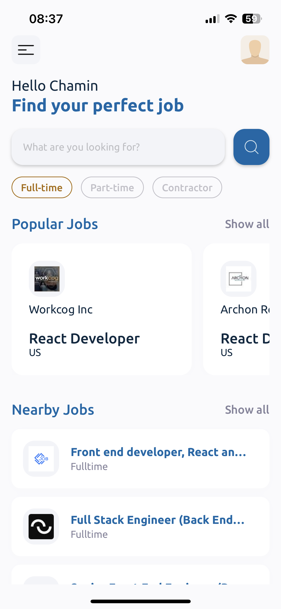
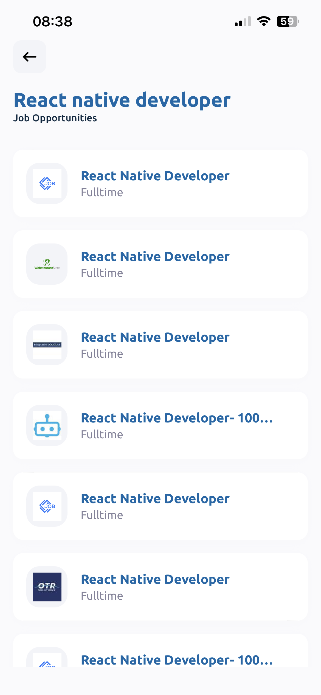
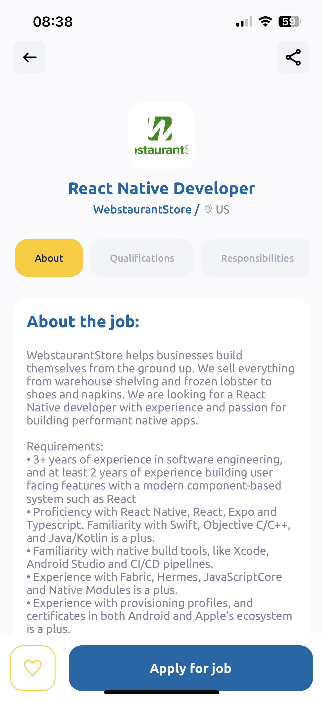

<div style="display: flex; align-items: start">

<h1> Job Search React Native App </h1>
</div>


### Screenshots

<div style="display: flex">



</div>

### Preview
<div>
<video src="./preview/appPreview.mp4" width="720" controls>
  <source src="./preview/appPreview.mp4" type="video/mp4">
  Your browser does not support the video tag.
</video>
</div>

## 🚀 How to start

- Add `.env` file at the root directory with the following value. Get the api key from [rapidapi.com](https://rapidapi.com/letscrape-6bRBa3QguO5/api/jsearch)
  ```
  RAPID_API_KEY=[jsearch api key]
  ```

- Install dependencies and start the project
  ```sh
  npm install
  npm start
  ```

## 📝 Notes

- [Expo Router: Docs](https://expo.github.io/router)
- [Expo Router: Repo](https://github.com/expo/router)
